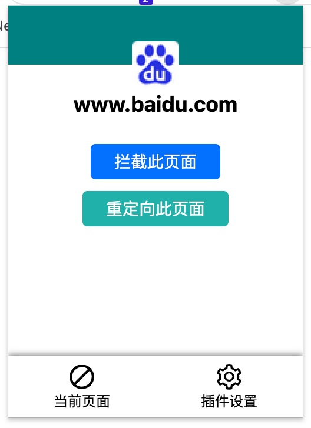
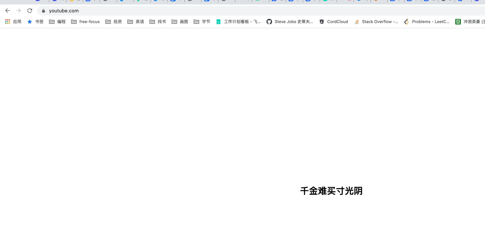
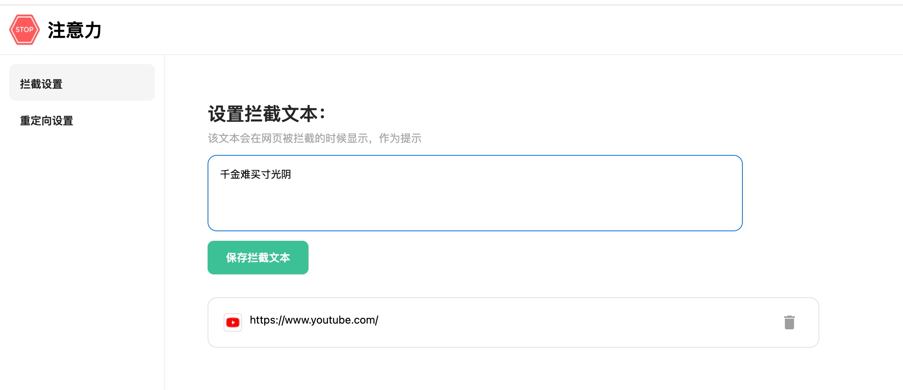
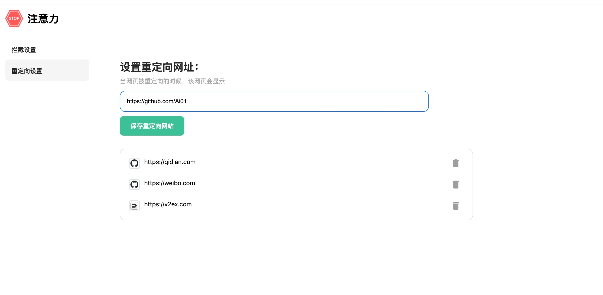

# WebBlockPlugin
用来阻止浏览网页的chrome浏览器插件

### 拦截页面

### 重定向页面

## 支持功能

* 拦截页面,并重写为对应的文本
* 重定向页面到制定页面

### mvp功能

* 联系开发者: 使用腾讯开源社群产品
* 重定向的页面不能拦截

### 附加功能(并不一定会做)

* 上网行为分析
* 设置block的时间段 
* 自定义的block提示页
* 内置页面分类，可对某一个类型的页面block
* 密码保护，阻止对block页面的解锁行为
* 白名单模式
* 服务器(多设备同步信息)
* block页面中插入广告

## 参考资料

别人总结的基本介绍：https://www.cnblogs.com/liuxianan/p/chrome-plugin-develop.html#%E8%8E%B7%E5%8F%96%E5%BD%93%E5%89%8D%E7%AA%97%E5%8F%A3id

官方的资料：https://developer.chrome.com/docs/extensions/

重写页面内容：https://stackoverflow.com/questions/57812809/replacing-the-entire-html-document-of-a-website-from-a-chrome-extension

竞品: https://chrome.google.com/webstore/detail/blocksite-block-websites/eiimnmioipafcokbfikbljfdeojpcgbh/related?hl=en&

无法使用inlineJs： https://stackoverflow.com/questions/16145522/chrome-showing-error-as-refused-to-execute-inline-script-because-of-content-sec

content_security_policy: 如何使用script标签引入其他host的js

利用react cdn资源使用react: https://gist.github.com/gaearon/6668a1f6986742109c00a581ce704605
